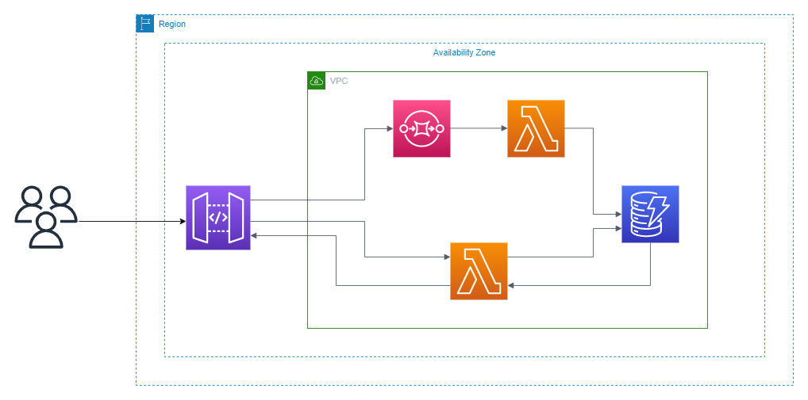
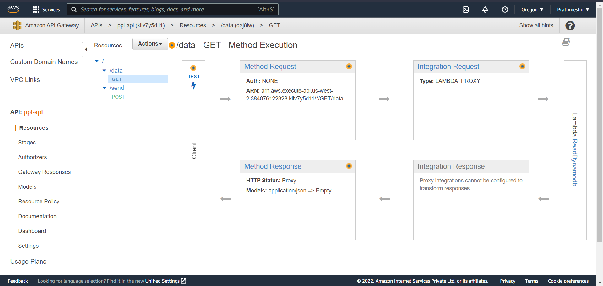
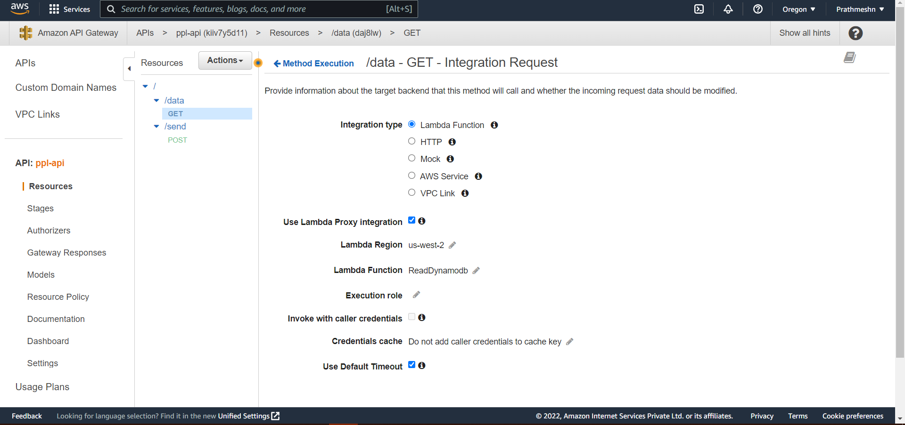
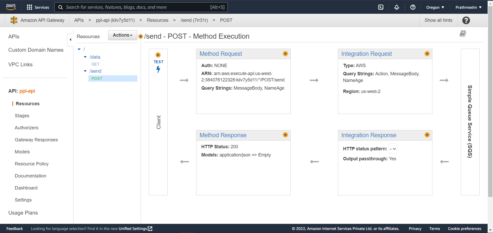
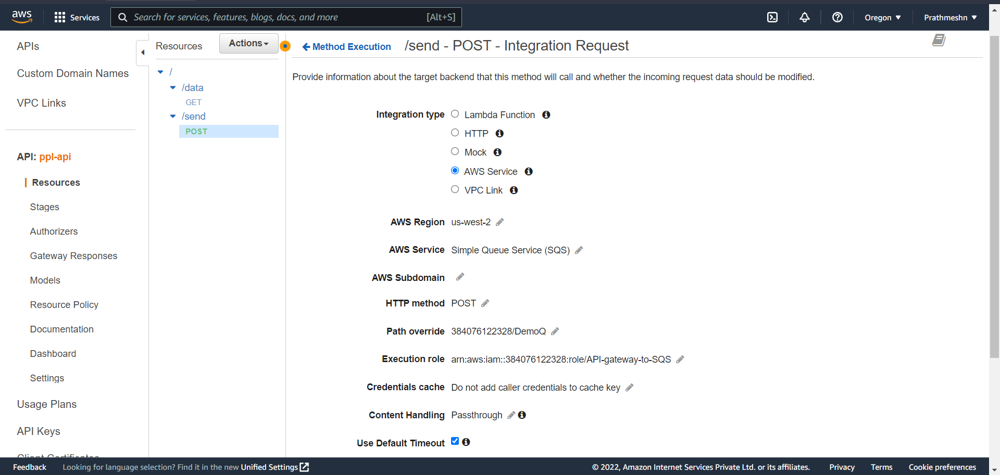
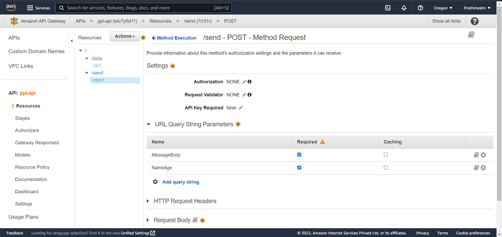
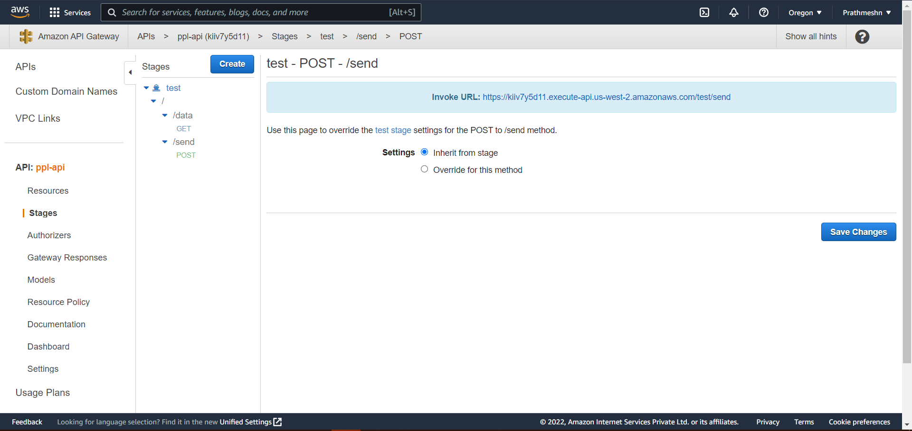
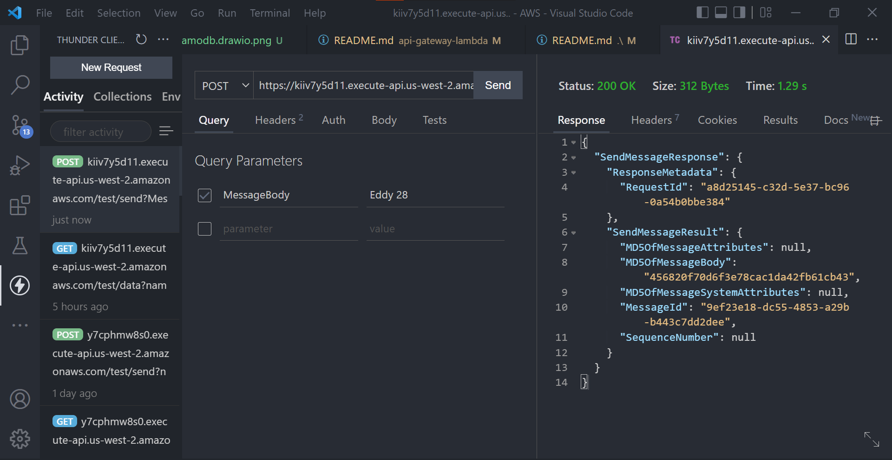
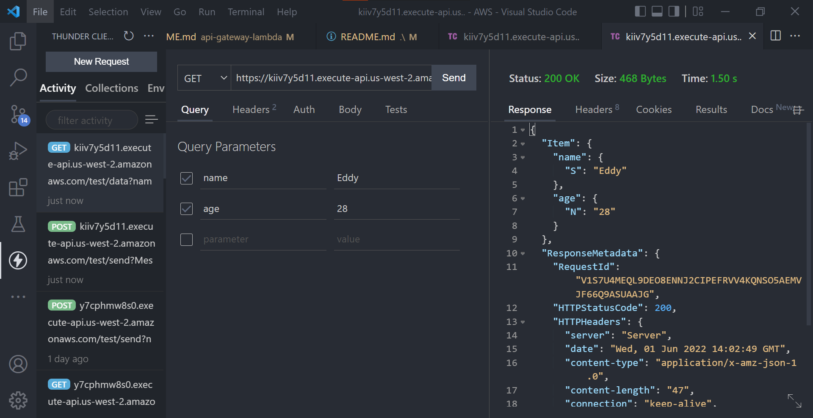

# API gateway to Dynamodb

POC for API Gateway to put messages to SQS and insert the data into DynamoDB with Lambda.

## Architecture



## Step - 1 Create IAM Policies and Roles

1. Create first role which contains access to lambda function to interact with DynamoDB & write logs to CloudWatch.
2. Create second role which contains permissions to access SQS and read all the messages
3. Create third role which contains permissions for API gateway to write logs to CloudWatch and forward the API request to SQS Queue.


## Step - 2 Create SQS queue
Simply create an SQS queue (standard) and leave it with default settings and note the URL of the queue.

## Step - 3 Create Lambda functions
1. Create first lambda function and assign it the roles which contains permission to access SQS and write the messages to DynamoDB. And add trigger as SQS from the list and select the name of the Queue you created previously.
2. Create second function and assign role which can access and return the records from DynamoDB.

## Step - 4 Create DyanmoDB table.
Go to the DynamoDB page and create a table containing a schema name(s) and age(N).

## Step - 5 Create API gateway

1. From the gateway page select REST API.
2. Select create new api.
3. From actions menu select create resource and select proper route '/' with name
4. click create.
5. Again from actions menu select create method select (POST), click on AWS service.
6. select SQS, select your current region, http method as POST.
7. Action type as path override, below enter your account-id/sqs queue name.
8. For Execution Role paste the ARN of the IAM role created in step - 1 having permissions to access SQS queue.
8. Keep content handling as 'Passthrough".
9. Click Save.
10. Create another resource with any name route and a method (GET)
11. In the method select Lambda integration, tick the option 'Use Lambda Proxy integration' and click Save

## Step - 6 Configuring API gateway
1. Scroll down in method request and select URL Query String Parameters and click on add query strings.
2. Type 'MessageBody' and tick required.
3. Scroll down in integration request and select URL Query String Parameters add a first entry where name is Action and mapped from is 'SendMessage'.
4. Add another entry where name is 'MessageBody' and mapped from as ```method.request.querystring.MessageBody```.














## Step - 7 Testing the API

1. Go back to previous page and click test, in query strings type 'MessageBody=amy 18'
now scroll down and click test. if you get response as 200 then its working fine else go the CloudWatch and check the appropriate logs.

## Step - 8 Deploying the API

1. From the top actions menu select deploy option, the popup menu select create a new stage and type 'test' and click create.
2. Next click on down arrow beside test, and click on /route-name -> POST in the sub-menu you will the URL to access it.
3. Copy the URL and paste it in either PostMan, Thunder client or any api testing tool.
4. Select the method as post and add query strings as 'MessageBody' as parameter and 'amy 18' as value & click send. You will see a proper response.
5. Now click on /route-anme -> GET and copy the URL.
6. Paste it Postman/Thunder client and select method as GET, also add the query strings as 'name' 'amy' and 'age' '18' then click on send.
7. Then you will see the response where the data from DynamoDB will be retrieved as response.




